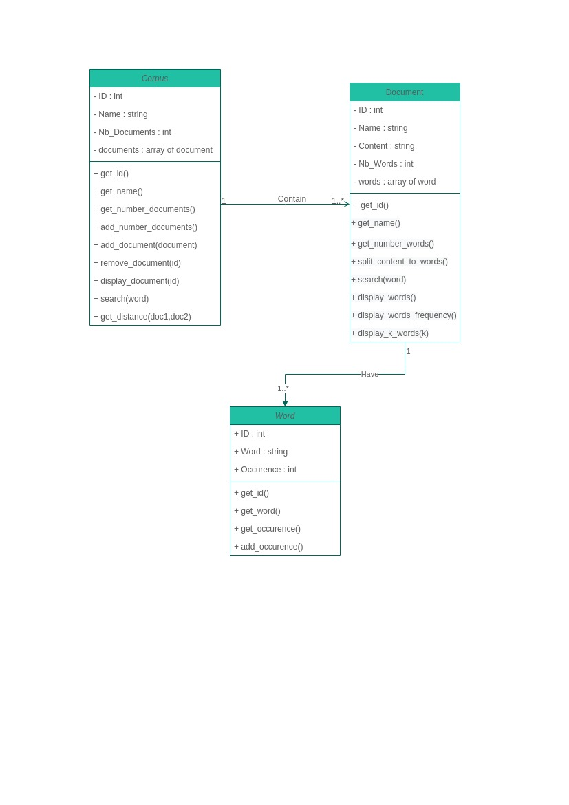

# this work is still under construction !

# Corpus Managment

## Requirement ( For best user experience )

- Linux Distribution installed ( Ubuntu Preference)
- G++
  > sudo apt install g++
- Figlet
  > sudo apt install figlet

## How to run the program

> ./Main

### Contact infos

- Linkdin : https://www.linkedin.com/in/chihebedinezoghlemi/
- Github : https://github.com/Chiheb-Edine-Zoghlemi/ParadigmeLangageProg

This project is made by ©Zoghlemi Chiheb Edine Enjoy 😁
